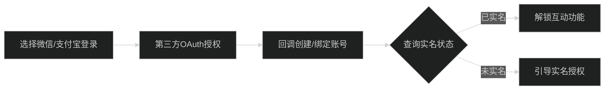
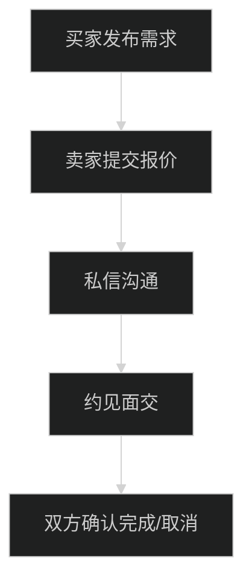
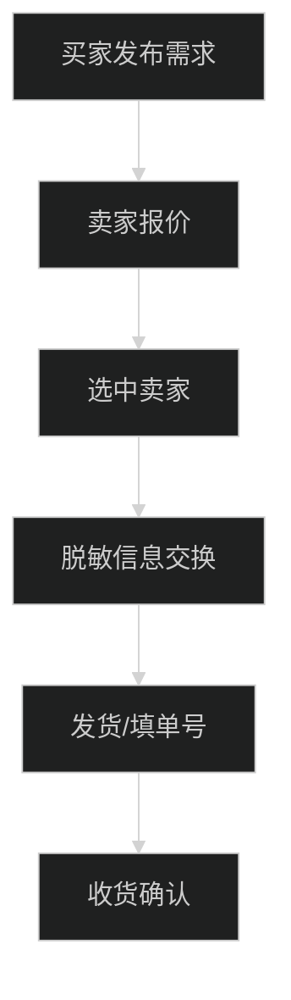

# 需求发布 App（反向闲鱼）— 需求分析文档

版本：v0.1（草案）  日期：YYYY-MM-DD  作者：产品/研发联合

---

## 一、产品概述
- 核心：买家发布“求购/求服务”需求（含期望价），卖家提交报价，站内沟通，线下或快递履约。
- 目标：撮合效率高、风险可控、隐私友好、移动端优先。

[是否确定需求 □是 □否]  [是否需要额外补充：________________]

## 二、已确认关键决策
1) 价格形态：支持“单一期望价”与“价位区间（min-max）”。
   - 字段：price_type(exact|range), expected_price, price_min, price_max。
   [是否确定需求 □是 □否]  [是否需要额外补充：________________]
2) 城市与跨城：列表默认同城优先；提供“一键只看同城”切换。
   - 字段：city，allow_cross_city(boolean)，排序策略：同城>近邻>全国。
   [是否确定需求 □是 □否]  [是否需要额外补充：________________]
3) 实名强度：发布、报价、IM、关注等互动操作需强制实名；未实名仅可浏览。
   - 登录：微信/支付宝 OAuth；实名：平台侧 KYC 状态位。
   [是否确定需求 □是 □否]  [是否需要额外补充：________________]

## 三、模块清单与优先级（P0/MVP 必须，P1 增强，P2 远期）
### P0（MVP 必须）
1) 账号与实名认证：微信/支付宝登录；实名状态获取与存储（仅状态/脱敏）。
   [确定 □是 □否]  [补充：________________]
2) 求购发布/浏览：标题、类目、期望价(或区间)、交易方式(线下/快递)、城市/跨城、描述、图片；列表/详情/筛选。
   [确定 □是 □否]  [补充：________________]
3) 卖家报价：金额、说明、图片、可履约方式、有效期(可选)；详情页报价列表查看/排序。
   [确定 □是 □否]  [补充：________________]
4) 站内消息：一对一文本/图片；违禁词提醒；未读角标。
   [确定 □是 □否]  [补充：________________]
5) 关注/订阅：关注买家、类目、关键词；新需求/新报价站内通知。
   [确定 □是 □否]  [补充：________________]
6) 交易流程状态记录：
   - 线下：约见→面交→双方确认完成/取消；
   - 快递：信息交换(脱敏)→发货填单号→收货确认。
   [确定 □是 □否]  [补充：________________]
7) 风控与举报：违禁词校验、黑名单、举报入口、频控。
   [确定 □是 □否]  [补充：________________]
8) 管理端（简）：需求审核、举报处理、封禁/下架。
   [确定 □是 □否]  [补充：________________]

### P1（增强迭代）
- 智能补全与模板、智能风控、增强搜索/订阅、评价信誉、多价策略、运营位（置顶/悬赏）。
  [确定 □是 □否]  [补充：________________]

### P2（远期）
- 担保交易/分阶段付款、B 端商家工具、海外多语多币、个性化推荐。
  [确定 □是 □否]  [补充：________________]

## 四、信息架构（移动端）
- 首页（同城优先/一键同城）、搜索与筛选、需求详情、发布需求、报价页/弹窗、消息列表/聊天、我的（资料/实名/我的需求/我的报价/关注）、登录/绑定、管理端（H5 简版）。
[是否确定需求 □是 □否]  [是否需要额外补充：________________]

## 五、关键流程（Mermaid）
1) 实名登录

2) 发布-响应-线下

3) 发布-响应-快递

## 六、核心数据模型（草案）
- User：id, nickname, avatar, city, role, auth_provider, kyc_status, risk_level, stats, created_at, status。
- Demand：id, user_id, category_id, title, desc, price_type, expected_price, price_min, price_max, trade_mode, city, allow_cross_city, images[], status, offer_count, chosen_offer_id, created_at, expired_at。
- Offer：id, demand_id, seller_id, price, message, images[], trade_mode, valid_until, status, created_at。
- Follow：id, user_id, target_type(user|category|keyword), target_id/keyword, created_at。
- Message：id, session_id, from_user, to_user, demand_id, content(text|image), created_at。
- AddressToken：id, user_id, demand_id, phone_masked, address_masked, payload_encrypted。
[是否确定需求 □是 □否]  [是否需要额外补充：________________]

## 七、API 草案（REST）
- Auth：POST /api/auth/login/{wechat|alipay}；GET /api/auth/me
- Demand：POST /api/demands；GET /api/demands；GET /api/demands/{id}；PATCH /api/demands/{id}
- Offer：POST /api/demands/{id}/offers；GET /api/demands/{id}/offers；PATCH /api/offers/{id}
- Follow：POST /api/follow；DELETE /api/follow/{id}；GET /api/follow/my
- Message：POST /api/messages；GET /api/messages?session_id=
- Report：POST /api/report
- Admin：GET /api/admin/review/queue；POST /api/admin/review/{targetId}/action
[是否确定需求 □是 □否]  [是否需要额外补充：________________]

## 八、风控与合规（MVP）
- 实名门槛、违禁词库、频控、举报/处置、隐私脱敏与加密存储、线下/快递安全提示。
[是否确定需求 □是 □否]  [是否需要额外补充：________________]

## 九、埋点与核心指标
- 漏斗：发布→首报→私信→完成；健康：均价/首响时间/报价数；安全：举报率/下架率；留存：关注触发与回访。
[是否确定需求 □是 □否]  [是否需要额外补充：________________]

## 十、MVP 范围与里程碑（2 周建议）
- W1：登录+实名、数据模型与API、发布/浏览/报价、基础风控。
- W2：IM、关注/通知、线下/快递状态记录、简版后台、联调与测试。
[是否确定需求 □是 □否]  [是否需要额外补充：________________]

## 十一、验收用例（10 条）
1) 未登录访问详情→要求登录→回跳成功。
2) 发布需求：相机，期望2000，快递→列表可见。
3) 卖家报价1800+图→详情顶部可见（按策略）。
4) 买家发起私信→可收发文本/图。
5) 选择快递→生成脱敏地址→卖家填单号。
6) 收货确认→需求完成。
7) 关注关键词“相机”→新需求站内通知。
8) 标题含违禁词→提交被拦截提示。
9) 1小时超频发单→频控限制。
10) 管理端标记违规→对外下架，状态更新。
[是否确定需求 □是 □否]  [是否需要额外补充：________________]

---

### 填写说明
- 每个需求点请勾选“是否确定需求”，并在“是否需要额外补充”处补充约束/字段/交互/边界案例。
- 我会基于你的勾选与补充，生成最终规格与交互稿，并输出接口契约与测试清单。
